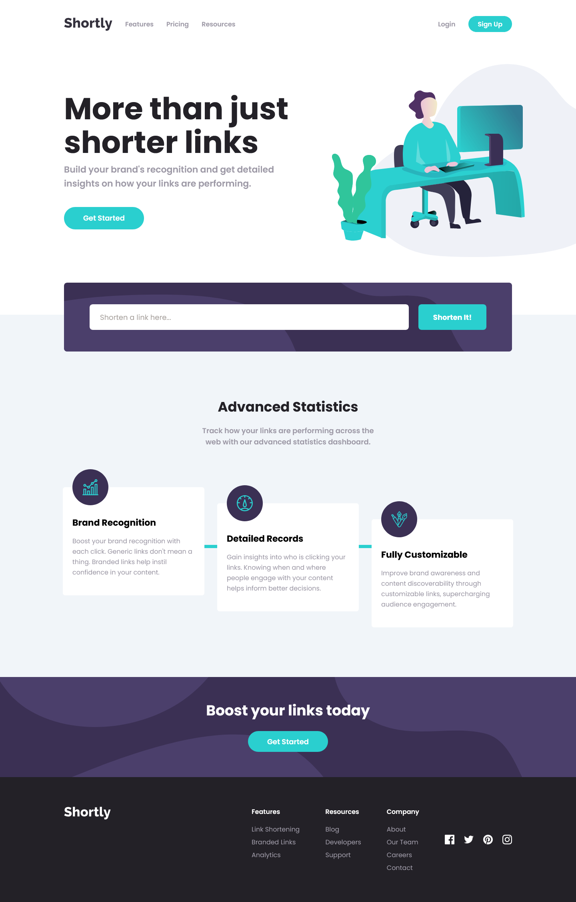

# Frontend Mentor - Shortly URL shortening API Challenge solution

This is a solution to the [Shortly URL shortening API Challenge challenge on Frontend Mentor](https://www.frontendmentor.io/challenges/url-shortening-api-landing-page-2ce3ob-G). Frontend Mentor challenges help you improve your coding skills by building realistic projects.

## Table of contents

- [Overview](#overview)
  - [The challenge](#the-challenge)
  - [Screenshot](#screenshot)
  - [Links](#links)
- [My process](#my-process)
  - [Built with](#built-with)
  - [What I learned](#what-I-learned)
  - [Useful resources](#useful-resources)
- [Author](#author)
- [Acknowledgments](#acknowledgments)

## Overview

### The challenge

Users should be able to:

- View the optimal layout for the site depending on their device's screen size
- Shorten any valid URL
- See a list of their shortened links, even after refreshing the browser
- Copy the shortened link to their clipboard in a single click
- Receive an error message when the `form` is submitted if:
  - The `input` field is empty

### Screenshot



### Links

- Solution URL: [Repository Link](https://github.com/mjclaypool/Shortly-Landing-Page)
- Live Site URL: [Live Link](https://shortly-landing-page-swart.vercel.app/)

## My process

### Built with

- Semantic HTML5 markup
- Flexbox
- Mobile-first workflow
- [React](https://reactjs.org/) - JS library
- [Next.js](https://nextjs.org/) - React framework
- [Tailwind CSS](https://tailwindcss.com/) - For styles

### What I learned
This project posed a couple different, unexpected challenges. First, Clean URI API does not respond to the browser "preflight" request that checks if the server will allow API requests before they are made. The browser sends a HTTP OPTIONS request, but the API only allows POST requests. Consequently, the preflight request fails and returns a cross-origin resource sharing (CORS) error, which is a browser security feature that prevents API calls from being made to a site from a different domain (unless the host site adds a header that allows other URLs).

Since the domain of both my locally-hosted and deployed React app differed from the Clean URI API site, I realized I would never be able to make my requests from a purely front-end application. So I transformed my React project into a fullstack application with Next.js and used rewrites to create a proxy for communicating with the API.

```js
async rewrites() {
    return [
      {
        source: '/shorten-link',
        destination: 'https://cleanuri.com/api/v1/shorten',
      },
    ]
  },
```

This worked great locally, but I ran into another issue after prepping the project to deploy to GitHub pages. GitHub pages can only host static sites, rewrites are not supported and the deployed site would never be able to reach the Clean URI API destination.

I decided to instead host my site on Vercel, which was created by the same creators of Next.js and makes deploying static or hybrid Next.js projects extremely easy. This will definitely be my go-to for any future Next.js projects.

### Useful resources

- [Tailwind CSS Documentation](https://tailwindcss.com/docs/installation) - This well-documented reference website helped me efficiently transition from vanilla CSS to Tailwind CSS. It is a popular CSS framework that promotes increased efficiency in styling applications.
- [Font Awesome Icons](https://fontawesome.com/icons) - This is pretty comprehensive library of classic and brand icons. It also offers various ways to add icons to your project, like via global import in React or copy/paste the svg tag.
- [Next.js - Rewrites](https://nextjs.org/docs/pages/api-reference/next-config-js/rewrites) - I used this site to learn how to create a proxy for reaching out to the Clean URI API from my application. The Next.js documentation has been extremely helpful so far, expecially considering this being my first Next.js project.
- [Next.js - Deploying Your App](https://nextjs.org/learn-pages-router/basics/deploying-nextjs-app/deploy) - I followed the instructions on this nextjs.org site to deploy my site to Vercel. This process was very straightforward and linked seamlessly with my GitHub repository.
- [MDN Web Docs - CORS](https://developer.mozilla.org/en-US/docs/Web/HTTP/CORS) - This page has a good explanation of what CORS does and functionally how it works.

## Author

- Website - [Mallory Claypool](https://mjclaypool.github.io/Personal-Portfolio/)
- Frontend Mentor - [@mjclaypool](https://www.frontendmentor.io/profile/mjclaypool)